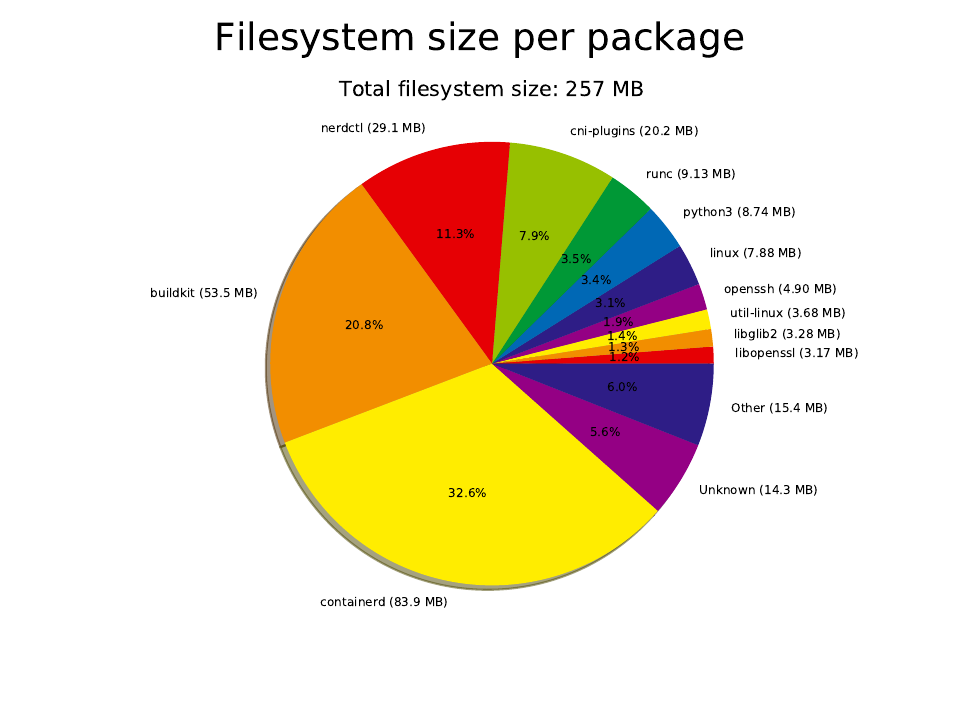

buildroot4containers
====================

Build a minimal environment with Buildroot, enough for running Docker with containerd.

Like an "updated" version of the deprecated boot2docker, running entirelly from memory.

Written by Anders Björklund (@afbjorklund)


Kernel
* namespaces
* cgroups
* overlayfs
* nat
* bridge
* conntrack
* vxlan

User
* nerdctl
* containerd
* buildkitd
* bash
* iptables




Bootable image:

```
72M	output/buildroot.iso
```

Device layout:

| QEMU | File          | Media | Device   | Used for          | Size |
| ---- | ------------- | ----- | -------- | ----------------- | ---- |
| -hda | disk.img      | disk  | /dev/sda | Persistent `/var` |  20g |
| -hdc | buildroot.iso | cdrom |          | Buildroot booting |  72m |

Reference board:

`qemu/x86_64`

```
4.9M	output/images/bzImage
84M	output/images/rootfs.ext2
```
