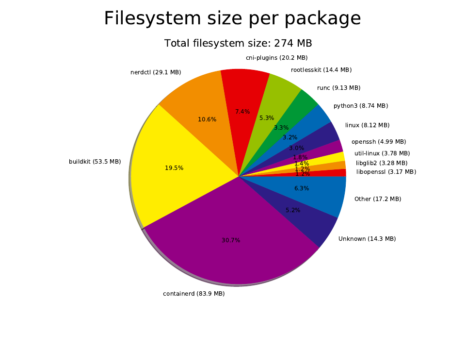

buildroot4containers
====================

Build a minimal environment with Buildroot, enough for running Lima with containerd.

Run from a resized disk image, but also include cloud-init for customization at boot.

Written by Anders Björklund (@afbjorklund)


Kernel
* namespaces
* cgroups
* overlayfs
* nat
* bridge
* conntrack
* vxlan

User
* nerdctl
* containerd
* buildkitd
* bash
* iptables




Bootable image:

```
94M	output/disk.img.gz
```

Device layout:

| QEMU | File          | Media | Device   | Used for          | Size |
| ---- | ------------- | ----- | -------- | ----------------- | ---- |
| -hda | disk.img      | disk  | /dev/sda | Persistent `/var` |  20g |
| -hdb | data.img      | disk  | /dev/sdb | Persistent `/data`|   5g |

Reference board:

`pc` (bios)

```
4.9M	output/images/bzImage
84M	output/images/rootfs.ext2
```
